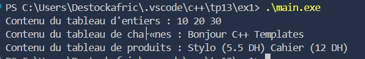
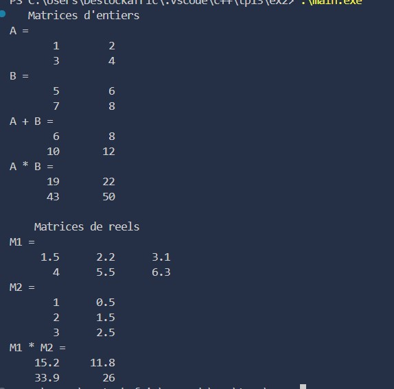
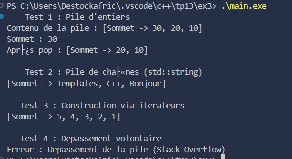
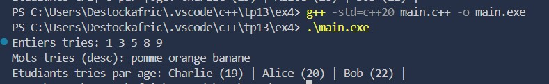

### Exercice 1 : Conteneur dynamique générique avec itérateur personnalisé

#### Objectif  
Écrire un conteneur générique semblable à std::vector mais sans dépendre de la STL et implémenter un itérateur bidirectionnel compatible avec les boucles range-based for.

#### Description  
- Template de classe **ArrayDyn<T>** gérant la capacité, la taille courante et un pointeur dynamique vers T.  
- Constructeurs : par défaut, avec capacité initiale, et de copie.  
- Méthodes : `push_back(const T&)`, `pop_back()`, `operator[]` avec contrôle de bornes.  
- Classe interne **Iterator** : opérateurs `*`, `++`, `--`, `!=`.  
- Méthodes `begin()` et `end()` pour l’itération.  
- Test avec différents types : `int`, `std::string`, et un objet personnalisé.

#### Fonctionnalités  
- Gestion de la mémoire dynamique sans STL.  
- Introduction aux **templates** et **itérateurs personnalisés**.  
- Compatible avec les **boucles for-range**.  

#### Résultat  

---

### Exercice 2 : Matrice générique + opérateurs arithmétiques

#### Objectif  
Manipuler des templates de classe avec plusieurs paramètres et surcharger des opérateurs pour les matrices.

#### Description  
- Template **Matrice<T, N, M>** stockant N*M éléments dans un tableau statique `data[N][M]`.  
- Constructeurs : par défaut initialisant à 0, et avec liste d’initialisation.  
- Surcharge des opérateurs : `+` (addition), `*` (produit matriciel), et `<<` pour affichage formaté.  
- Vérification avec des matrices d’entiers et de double.  
- Optionnel : spécialisation pour `bool` avec produit logique.

#### Fonctionnalités  
- Utilisation avancée de **templates avec paramètres multiples**.  
- Surcharge d’**opérateurs arithmétiques**.  
- Affichage formaté des matrices.

#### Résultat  

---

### Exercice 3 : Pile générique sécurisée avec std::unique_ptr

#### Objectif  
Combiner templates et pointeurs intelligents pour gérer une pile avec sécurité mémoire et exceptions.

#### Description  
- Template **Stack<T>** utilisant un tableau dynamique géré par `std::unique_ptr<T[]>`.  
- Attributs : capacité `capacity` et sommet `top`.  
- Méthodes : `push(const T&)`, `pop()`, `peek() const`, `empty() const`.  
- Exceptions personnalisées : `StackOverflow` et `StackUnderflow`.  
- Constructeur par défaut et constructeur prenant un itérateur pour initialisation.  
- Test avec un grand nombre d’objets et vérification de l’absence de fuite mémoire.

#### Fonctionnalités  
- Gestion automatique de la mémoire avec **unique_ptr**.  
- Implémentation de **templates génériques**.  
- Gestion d’**exceptions spécifiques** pour la pile.

#### Résultat  

---

### Exercice 4 : Foncteur générique de tri avec contraintes C++20 (concepts)

#### Objectif  
Employer les concepts C++20 pour restreindre les types acceptés par un template et implémenter un algorithme de tri paramétrable.

#### Description  
- Définition du concept **Sortable** : `{ a < b } -> convertible_to<bool>;`.  
- Fonction template **quickSort** avec comparateur `Comp` (par défaut `std::less<T>`).  
- Foncteurs de comparaison : `Asc` (ordre croissant) et `Desc` (ordre décroissant).  
- Tests avec `std::vector<int>`, `std::vector<std::string>` et une structure utilisateur possédant `operator<`.  
- Vérification que le vecteur est correctement trié après appel.

#### Fonctionnalités  
- Utilisation des **concepts C++20** pour restreindre les types.  
- Tri paramétrable via **foncteurs**.  
- Compatible avec plusieurs types génériques et structures utilisateurs.

#### Résultat  

